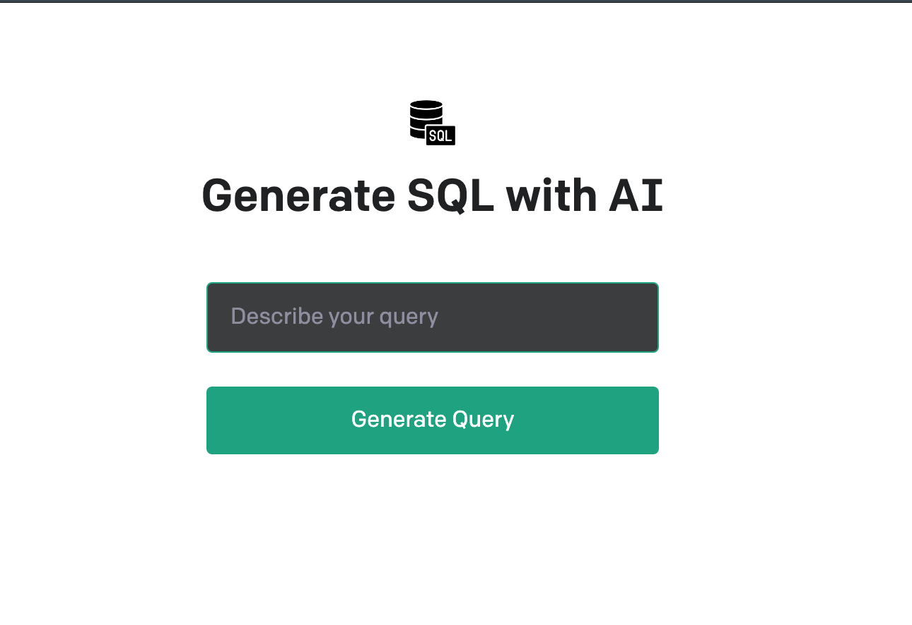

# SQL Query Generator

This repository contains a React TypeScript client and Node TypeScript server that work together to generate SQL queries from natural language prompts using OpenAI's API.

## Prerequisites

To use this repository, you will need:

- A valid API key for OpenAI's API.
- Node.js installed on your machine.

## Getting Started
create a `.env` file in the root directory of the repository and add your OpenAI API key to it as follows:

OPENAI_API_KEY=your_api_key_here

## Usage

To generate a SQL query from a natural language prompt, simply enter the prompt into the input field on the client and click the "Generate" button. The client will send the prompt to the server, which will use OpenAI's API to generate a SQL query, and then send the query back to the client, which will display it on the page.

## License

This repository is licensed under the MIT License. See the `LICENSE` file for more information.

